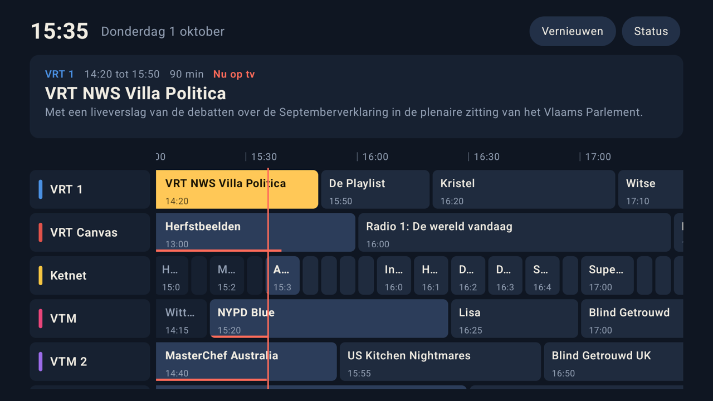

# TV Gids voor Google TV

[](https://github.com/Baconfish9/TVGids4Streamer/actions/workflows/apk.yml)
[](https://github.com/Baconfish9/TVGids4Streamer/releases/latest)


Een live tv-gids met tijdlijn voor de **Google TV Streamer**, met de Vlaamse zenders
(VRT, VTM, Play) en de Nederlandse publieke omroep (NPO). Volledig te bedienen met de
afstandsbediening, en met één druk op de knop door naar VRT MAX, VTM GO, Play of NPO Start.
Werkt ook op Android-telefoons en -tablets, in liggende stand.



## Inhoud

- [Functies](#functies)
- [Zenders](#zenders)
- [Installeren](#installeren)
- [Bediening](#bediening)
- [Programmagegevens](#programmagegevens)
- [Zelf bouwen](#zelf-bouwen)
- [Aanpassen](#aanpassen)
- [Projectstructuur](#projectstructuur)

## Functies

- **Tijdlijn van 30 uur** vanaf twee uur geleden, met een rode lijn op het huidige tijdstip
  en een voortgangsbalk onder elk programma dat nu loopt.
- **Gemaakt voor de afstandsbediening**: de tijdlijn schuift mee terwijl je bladert. Titels
  van lange programma's blijven zichtbaar aan de linkerrand en heel korte opvullers worden
  overgeslagen.
- **Ook op telefoon en tablet** (liggend): vegen door de tijdlijn, tikken voor details en
  een knop **Nu** om terug te springen. Hou je het toestel rechtop, dan vraagt een
  animatie om het te draaien. Op een telefoon verdwijnt het infopaneel om plaats te sparen.
- **Infopaneel en detailvenster** met uren, duur, genre en beschrijving.
- **Kijken of terugkijken**: vanuit het detailvenster open je meteen de app van de zender.
- **Automatisch verversen** zodra de gegevens ouder zijn dan 6 uur. Je positie in de gids
  blijft daarbij behouden.
- **Snel opstarten**: de laatste gids wordt bewaard, zodat de app meteen iets toont, ook
  zonder internet.
- **Statusscherm** per bron en per zender, handig om ontbrekende zenders te koppelen.
- **Belgische tijd**: alle uren in Europe/Brussels, los van de instelling van het toestel.

## Zenders

| Vlaanderen | App | Nederland | App |
|---|---|---|---|
| VRT 1, VRT Canvas, Ketnet | VRT MAX | NPO 1, NPO 2, NPO 3 | NPO Start |
| VTM, VTM 2, VTM 3, VTM 4, VTM GOLD | VTM GO | | |
| Play, Play Fictie, Play Actie, Play Crime, Play Reality | Play | | |

De lijst staat in [`Config.kt`](app/src/main/java/be/tvgids/app/Config.kt); zie
[Aanpassen](#aanpassen).

## Installeren

De laatste APK staat altijd op dezelfde plaats:

```
https://github.com/Baconfish9/TVGids4Streamer/releases/latest/download/TVGids.apk
```

Eerst eenmalig de ontwikkelaarsopties aanzetten op de Streamer: **Instellingen > Systeem >
Over** en 7 keer klikken op **Android TV OS-build**.

### Met de app Downloader (geen computer nodig)

1. Installeer **Downloader** (van AFTVnews) uit de Play Store.
2. **Instellingen > Apps > Beveiliging en beperkingen > Onbekende bronnen**: zet Downloader aan.
3. Open Downloader, typ de link hierboven en kies **Installeren**.

### Met ADB vanaf je computer

Zet in de ontwikkelaarsopties **Draadloze foutopsporing** aan en kies **Apparaat koppelen met
koppelingscode**:

```sh
adb pair <ip>:<koppelpoort>
adb connect <ip>:<poort>
adb install -r TVGids.apk
```

De app verschijnt daarna bij je apps op Google TV. Een nieuwe versie installeer je op dezelfde
manier; ze komt gewoon over de vorige.

## Bediening

| Toets | Actie |
|---|---|
| Pijltjes | Door zenders en tijd bladeren |
| OK | Details van het programma |
| Omhoog vanaf de eerste zender | Naar de knoppen **Vernieuwen** en **Status** |
| Terug | Detailvenster of statusscherm sluiten |

Op een telefoon of tablet veeg je horizontaal door de tijd en verticaal door de zenders.
Tik op een programma voor de details; **Nu** brengt je terug naar het huidige uur.

In het detailvenster zie je **Kijken in …** bij een programma dat nu loopt en
**Terugkijken in …** bij een programma dat al voorbij is. Bij een programma dat nog moet
beginnen staat er geen kijkknop.

## Programmagegevens

De gids leest [XMLTV](https://wiki.xmltv.org/)-bestanden (`.xml` of `.xml.gz`). Standaard
komen die van [open-epg.com](https://www.open-epg.com/) (twee Belgische en twee Nederlandse
bestanden). De bronnen worden tegelijk opgehaald; staat een programma in meer dan één bron,
dan wint de bron die het eerst in de lijst staat.

Je kan ook een eigen bron gebruiken, bijvoorbeeld een bestand dat je dagelijks genereert met
[iptv-org/epg](https://github.com/iptv-org/epg) en ergens online zet.

### Een zender zonder gegevens?

Open in de app **Status**. Daar zie je:

1. per bron of ze gelukt is en hoeveel programma's ze bevat,
2. per zender hoeveel programma's er gevonden zijn,
3. onder welke namen de overige zenders in de bronnen staan.

Zoek de juiste naam in die laatste lijst, voeg hem toe aan de `aliassen` van de zender in
`Config.kt` en bouw opnieuw. Namen worden vergeleken zonder hoofdletters, accenten,
leestekens en achtervoegsels zoals `HD` of `BE`, dus `Eén HD` en `een.be` zijn hetzelfde.

## Zelf bouwen

### Via GitHub Actions

Elke push naar `main` start de workflow [**APK bouwen**](.github/workflows/apk.yml). Die
draait eerst de unit tests, bouwt daarna de APK en publiceert hem als release `latest`. Dat
duurt een vijftal minuten.

Elke build krijgt het versienummer `1.0.<buildnummer>`. Je ziet het in de app bovenaan in
**Status**.

Werk je met een eigen kopie, dan werkt dat net zo: zet de bestanden in een eigen repository
(inclusief de map `.github`). De downloadlink wordt dan
`https://github.com/<gebruiker>/<repo>/releases/latest/download/TVGids.apk`.

### Lokaal

Vereisten: een recente Android Studio (het project gebruikt AGP 9.4.1, Gradle 9.6.0 en JDK 21).

Open de map in Android Studio, laat Gradle synchroniseren en kies **Build > Build App
Bundle(s) / APK(s) > Build APK(s)**. Of vanaf de commandolijn, met Gradle 9.6.0:

```sh
gradle assembleRelease       # APK in app/build/outputs/apk/release/
gradle testDebugUnitTest     # unit tests
```

> **Let op:** een lokale build heeft versie 1 en installeert dus niet over een build van
> GitHub. De-installeer eerst, of gebruik voor een debug-build `adb install -r -d`.

### Ondertekening

De APK wordt ondertekend met `app/tvgids-debug.keystore`, die bewust in de repository staat.
Zo heeft elke build dezelfde handtekening en installeert hij over de vorige. Gebruik deze
sleutel niet voor een publicatie in de Play Store.

## Aanpassen

Alles staat in [`Config.kt`](app/src/main/java/be/tvgids/app/Config.kt):

- **`EPG_BRONNEN`**: de lijst met XMLTV-adressen.
- **`ZENDERS`**: naam, land, kleur, aliassen en de app die bij **Kijken** geopend wordt.

Voeg je een **nieuwe kijk-app** toe, vermeld het pakket dan ook in de `<queries>` van
[`AndroidManifest.xml`](app/src/main/AndroidManifest.xml). Zonder dat vindt Android 11 en
nieuwer de app niet. Pakketnamen op je Streamer vind je met:

```sh
adb shell pm list packages | grep -i -E "vrt|vtm|npo|goplay"
```

Na het aanpassen van de zenders vangen de unit tests botsende aliassen op, dus twee zenders
die naar dezelfde naam luisteren.

## Projectstructuur

```
app/src/main/java/be/tvgids/app/
├── Config.kt        Zenders, EPG-bronnen en het vergelijken van zendernamen
├── DraaiMelding.kt  Geanimeerde melding om een telefoon of tablet liggend te houden
├── Epg.kt           XMLTV-parser, ophalen, opschonen en cache
├── GidsScherm.kt    De gids, het detailvenster en het statusscherm (Jetpack Compose)
└── MainActivity.kt  Activity en ViewModel, automatisch verversen
app/src/test/        Unit tests
```
